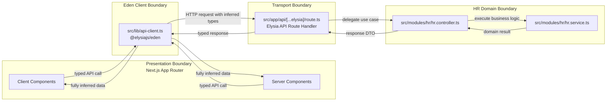

# Architecture Overview

This document defines the request flow and responsibility boundaries for the Next.js + Elysia hybrid application.

## Boundaries

- Presentation Boundary: Next.js Client and Server Components in `src/app/`
- API Client Boundary: Eden client wrapper in `src/lib/api-client.ts`
- Transport Boundary: Elysia route bridge in `src/app/api/[...elysia]/route.ts`
- Domain Boundary: HR module in `src/modules/hr/`

## Request Flow (Sequence + Boundaries)

## Responsibility Rules

- Next.js components orchestrate UI and state only; no business rules.
- Eden client centralizes typed API access; no domain logic.
- Route handler validates and delegates; no core business rules.
- HR service contains business rules and data shaping for HR use cases.
- Type contracts flow from Elysia AppType to Eden for end-to-end type safety.
